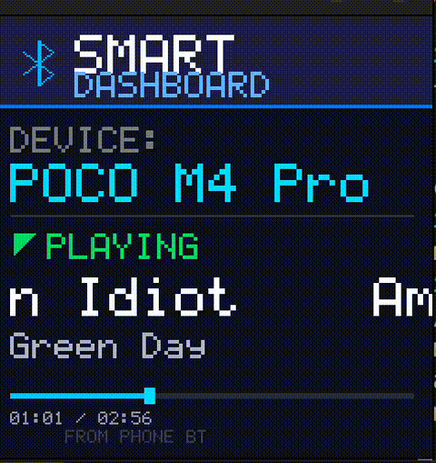

# BT Audio Laptop Simulator (TFT LCD)

A C-based graphical simulator for a 240x240 TFT LCD that displays real-time music metadata streamed via Bluetooth from a mobile device to a Linux laptop.

## Demo


This project uses SDL2 for rendering and interacts with BlueZ via D-Bus and `playerctl` to fetch track information (Title, Artist, and Status).

## Features
- Real-time Bluetooth music metadata display.
- Animated Bluetooth icon and progress bar.
- Marquee effect for long song titles and artists.
- Playback status indicator (Playing/Paused/Stopped).
- Custom 240x240 TFT LCD rendering engine using SDL2.

## Compatibility
- **Operating System:** Linux (Ubuntu/Debian recommended).
- **Bluetooth:** Requires BlueZ and a connected Bluetooth device with AVRCP support (e.g., Android/iOS phone).
- **Libraries:** SDL2.

## Prerequisites
Install the following dependencies:
```bash
sudo apt update
sudo apt install libsdl2-dev playerctl bluez
```

## Configuration
Before running, you must update the Bluetooth device path in `bt_tft.c`.

1. Find your device path:
   ```bash
   bluetoothctl devices
   ```
   Note the MAC address (e.g., `48:87:59:00:AC:6E`).
2. Convert the MAC address to the D-Bus format (replace `:` with `_`):
   `dev_48_87_59_00_AC_6E`
3. Edit `bt_tft.c` and update the `BT_DEVICE_PATH`:
   ```c
   #define BT_DEVICE_PATH "/org/bluez/hci0/dev_YOUR_MAC_ADDRESS"
   ```

## Compiling and Running
To build the project:
```bash
make
```
To run the Bluetooth TFT dashboard:
```bash
./bt_tft
```

## License
MIT License
